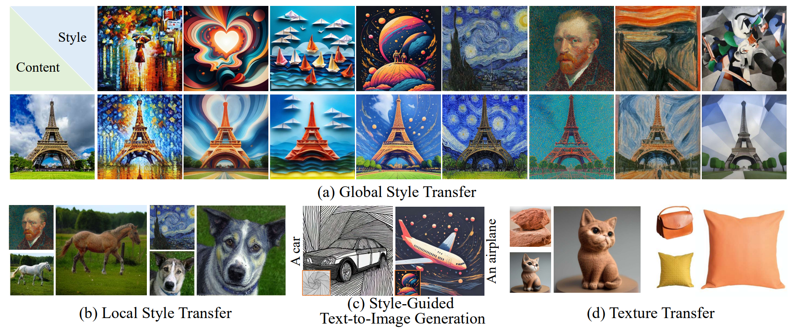

# <center>SigStyle: Signature Style Transfer via Personalized Text-to-Image Models, AAAI 2025 Poster </center>

<p align="center">
  <a href="https://wangyephd.github.io/"> <b>Ye Wang</b> </a><sup>1</sup> 
  <a href="#"> <b>Tongyuan Bai</b> </a><sup>1</sup>
  <a href="#"> <b>Xuping Xie</b> </a><sup>2</sup> 
  <a href="https://is.nju.edu.cn/yzl_en/main.htm"> <b>Zili Yi</b> </a><sup>3</sup> 
  <a href="https://yilinwang.org/"> <b>Yilin Wang</b> </a><sup>4</sup> 📩
<a href="https://ruim-jlu.github.io/#about"> <b>Rui Ma</b> </a><sup>1,5</sup> 📩
</p>

<p align="center">
  <sup>1</sup>School of Artificial Intelligence, Jilin University, <br>
  <sup>2</sup>College of Computer Science and Technology, Jilin University,<br> 
  <sup>3</sup>School of Intelligence Science and Technology, Nanjing University,<br>   
  <sup>4</sup>Adobe,<br>
  <sup>5</sup>Engineering Research Center of Knowledge-Driven Human-Machine Intelligence, MOE, China


<p align="center">
  <a href="https://arxiv.org/abs/2502.13997">
    
  </a>
  <a href="https://wangyephd.github.io/projects/sigstyle.html">
    
  </a>
</p>

<p align="center">
  
</p>

---

## 🚀 News

- 🎉 [2024.12] Our paper **"SigStyle: Signature Style Transfer via Personalized Text-to-Image Models"** has been accepted by **AAAI 2025**!  
- 📢 [2025.03] We released the core code of **style transfer**! 🔥💻  


## Abstract
Style transfer enables the seamless integration of artistic styles from a style image into a content image, resulting in visually striking and aesthetically enriched outputs. Despite numerous advances in this field, existing methods did not explicitly focus on the signature style, which represents the distinct and recognizable visual traits of the image such as geometric and structural patterns, color palettes and brush strokes etc. In this paper, we introduce SigStyle, a framework that leverages the semantic priors that embedded in a personalized text-to-image diffusion model to capture the signature style representation. This style capture process is powered by a hypernetwork that efficiently fine-tunes the diffusion model for any given single style image. Style transfer then is conceptualized as the reconstruction process of content image through learned style tokens from the personalized diffusion model. Additionally, to ensure the content consistency throughout the style transfer process, we introduce a time-aware attention swapping technique that incorporates content information from the original image into the early denoising steps of target image generation. Beyond enabling high-quality signature style transfer across a wide range of styles, SigStyle supports multiple interesting applications, such as local style transfer, texture transfer, style fusion and style-guided textto-image generation. Quantitative and qualitative evaluations demonstrate our approach outperforms existing style transfer methods for recognizing and transferring the signature styles.

## Get Started

### 1. Clone the repo and prepare the environment
  
```
git clone https://github.com/wangyePHD/SigStyle.git
cd SigStyle
pip install -r requirements.txt
```


### 2. Download the pre-trained models

```
huggingface-cli download  --resume-download CompVis/stable-diffusion-v1-4 --local-dir Weights/CompVis/stable-diffusion-v1-4 --local-dir-use-symlinks False

huggingface-cli download  --resume-download laion/CLIP-ViT-B-32-laion2B-s34B-b79K --local-dir Weights/laion/CLIP-ViT-B-32-laion2B-s34B-b79K --local-dir-use-symlinks False

```

### Training

```
bash style_inversion_train.sh 0 05 painting 0.1 1 
```

📌 Parameter Explanation
- 0: GPU index (set to 0 for the first GPU)
- 05: Name of the style image (without extension). Refer to the data/style/ folder.
- painting: domain words.
- 0.1: Default value (keep as is).
- 1: Batch size.


Note: The tuning steps may vary depending on the style image, but generally, 2000 steps should be sufficient. You can save the model every 100 steps and test them separately.

### Testing

```
bash style_inversion_test.sh 
```

Parameters Explanation
- `name`: The test name, used for storing files related to this test.
- `pretrained_folder`: The folder containing the pretrained model, usually located in the "Outs" folder.
- `result_folder`: The folder where test results are saved, dynamically named based on the `name` variable.
- `edit_prompt`: The text prompt used for style transfer, specifying the style to apply to the target image.
- `reference_img`: The reference style image, which should match the images used during training to ensure consistent style transfer.
- `edit_img`: The target image to which the style transfer will be applied.
- `source_prompt`: The original content description of the target image, used to maintain content consistency during style transfer.
